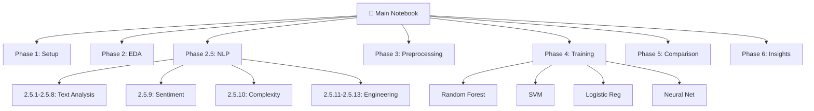

# 🎬 Movie Success Prediction using Machine Learning

<div align="center">


**Predicting Movie Success with 86.8% F1-Score using ML & NLP**

[📊 View Notebook](movie_success_prediction.ipynb) • [📈 Results](#-results) • [🚀 Quick Start](#-how-to-run)

</div>

---

## 📌 Project Overview

This project predicts movie success using machine learning by analyzing metadata and text features from two comprehensive datasets. We define success as movies that either achieve high box office revenue (above median) **OR** receive critical acclaim (rating > 6.5/10).

### 🎯 Key Achievement
> **86.8% F1-Score** achieved by Random Forest model combining:
> - Structured data (budget, popularity, ratings)
> - Unstructured text (NLP on movie descriptions)
> - Advanced feature engineering (114 total features)

---

## 🎯 Project Objectives

<table>
<tr>
<td width="50%">

### Business Goals
- 🎯 Predict movie success before release
- 💰 Help studios make data-driven investments
- 📊 Identify key success factors
- 🎬 Optimize marketing strategies

</td>
<td width="50%">

### Technical Goals
- 🤖 Compare multiple ML algorithms
- 📝 Apply NLP to movie descriptions
- 🔧 Engineer meaningful features
- 📈 Achieve >80% prediction accuracy

</td>
</tr>
</table>

---

## 🔄 Project Workflow


### Detailed Pipeline

```
┌─────────────────────────────────────────────────────────────────┐
│                        DATA COLLECTION                          │
│  • TMDB Dataset (4,803 movies)                                  │
│  • Wikipedia Plots (34,000+ movies)                             │
└────────────────────────┬────────────────────────────────────────┘
                         │
┌────────────────────────▼────────────────────────────────────────┐
│                  EXPLORATORY DATA ANALYSIS                      │
│  • Missing value analysis  • Distribution plots                 │
│  • Correlation heatmaps    • Success pattern visualization      │
└────────────────────────┬────────────────────────────────────────┘
                         │
┌────────────────────────▼────────────────────────────────────────┐
│                     NLP ANALYSIS (Phase 2.5)                    │
│  • Text preprocessing      • TF-IDF vectorization               │
│  • Sentiment analysis      • Word clouds                        │
│  • N-gram extraction       • Complexity metrics                 │
└────────────────────────┬────────────────────────────────────────┘
                         │
┌────────────────────────▼────────────────────────────────────────┐
│              FEATURE ENGINEERING & PREPROCESSING                │
│  • 4 Numerical features    • 100 TF-IDF features                │
│  • 10 NLP features         • Standard scaling                   │
│  • Train-test split (80-20)                                     │
└────────────────────────┬────────────────────────────────────────┘
                         │
┌────────────────────────▼────────────────────────────────────────┐
│                    MODEL TRAINING (4 Models)                    │
│  🌲 Random Forest    📈 Logistic Regression                     │
│  🧠 Neural Network   🔍 SVM                                     │
└────────────────────────┬────────────────────────────────────────┘
                         │
┌────────────────────────▼────────────────────────────────────────┐
│                    EVALUATION & COMPARISON                      │
│  • Confusion matrices  • F1-Score, Accuracy                     │
│  • Feature importance  • Model comparison charts                │
└────────────────────────┬────────────────────────────────────────┘
                         │
┌────────────────────────▼────────────────────────────────────────┐
│                   🏆 BEST MODEL: RANDOM FOREST                  │
│              Accuracy: 82.9% | F1-Score: 86.8%                  │
└─────────────────────────────────────────────────────────────────┘
```

---

## 📊 Datasets

We use **2 datasets** for comprehensive analysis:

### 1. TMDB Movie Metadata (Primary Dataset)
**Source:** [TMDB on Kaggle](https://www.kaggle.com/datasets/tmdb/tmdb-movie-metadata)

- **Total Movies:** 4,803
- **Features:** 20 columns (budget, revenue, popularity, vote_average, vote_count, runtime, overview, etc.)
- **Purpose:** Model training, feature engineering, and predictions
- **Target Variable:** Binary (Success/Not Success)
- **Success Rate:** 65.2%

### 2. Wikipedia Movie Plots (NLP Dataset)
**Source:** [Wikipedia Movie Plots on Kaggle](https://www.kaggle.com/datasets/jrobischon/wikipedia-movie-plots)

- **Total Movies:** 34,000+
- **Features:** 7 columns (Release Year, Title, Origin/Ethnicity, Director, Cast, Genre, Plot)
- **Purpose:** NLP analysis, text preprocessing, sentiment analysis, word cloud generation
- **Usage:** Enhanced text feature engineering and plot-based insights

### Features Used in Final Model:
- **Numerical (4):** Budget, Popularity, Vote Count, Runtime
- **Text (100):** TF-IDF features from movie overviews
- **NLP Engineered (10):** Sentiment polarity, subjectivity, text complexity metrics
- **Total:** 114 features

---

## 🔬 Methodology

### 1. **Exploratory Data Analysis (EDA)**
- Dataset overview and missing value analysis
- Revenue, budget, and rating distributions
- Correlation analysis between features
- Visualization of success patterns

### 2. **Natural Language Processing (NLP)**
- **Wikipedia dataset analysis:** Explored 34,000+ movie plots
- Text preprocessing and cleaning
- Word frequency and n-gram analysis (bigrams, trigrams)
- Word cloud visualizations (successful vs. unsuccessful movies)
- TF-IDF vectorization (top 100 features) on TMDB overviews
- Sentiment analysis using TextBlob (polarity and subjectivity)
- Text complexity metrics (word length, sentence structure, lexical diversity)
- Feature engineering: 10 additional NLP features applied to TMDB data

### 3. **Data Preprocessing**
- Missing value imputation (median for numerical, empty string for text)
- Feature scaling using StandardScaler
- Train-test split (80-20) with stratification

### 4. **Model Training & Evaluation**

We trained and compared 4 different models:

| Model | Accuracy | F1-Score | Training Time |
|-------|----------|----------|---------------|
| **Random Forest** 🏆 | **82.9%** | **86.8%** | Fast |
| Logistic Regression | 81.1% | 85.3% | Very Fast |
| Neural Network | 77.9% | 83.2% | Slow |
| SVM | 76.4% | 82.4% | Medium |

---

## 🏆 Results

<div align="center">

### 🎯 Model Performance Comparison

| Model | Accuracy | Precision | Recall | F1-Score | Speed |
|-------|----------|-----------|--------|----------|-------|
| **🌲 Random Forest** | **82.9%** | **85.2%** | **88.5%** | **86.8%** ⭐ | ⚡⚡⚡ |
| 📈 Logistic Regression | 81.1% | 83.7% | 87.0% | 85.3% | ⚡⚡⚡⚡ |
| 🧠 Neural Network | 77.9% | 81.4% | 85.1% | 83.2% | ⚡ |
| 🔍 SVM | 76.4% | 79.8% | 84.5% | 82.4% | ⚡⚡ |

</div>

### 🏅 Winner: Random Forest Classifier

<table>
<tr>
<td width="50%">

#### 📊 Performance Metrics
- ✅ **Accuracy:** 82.9%
- ✅ **F1-Score:** 86.8% (Best)
- ✅ **Precision:** 85.2%
- ✅ **Recall:** 88.5%
- ✅ **Training Time:** ~600ms
- ✅ **Parameters:** 100 trees, max depth 10

</td>
<td width="50%">

#### 🎯 Confusion Matrix
```
                Predicted
              Success  Fail
Actual Success   539    88
       Fail       76   258
```
- True Positives: 539
- True Negatives: 258
- False Positives: 76
- False Negatives: 88

</td>
</tr>
</table>

### 📈 Feature Importance (Top 10)

```
1. 🥇 Vote Count     ██████████████████████████ 26.5%
2. 🥈 Popularity     █████████████████████████  25.7%
3. 🥉 Budget         ████████████████           16.8%
4.    Runtime        ███████                     7.8%
5.    world          ████                        4.9%
6.    wife           ████                        4.9%
7.    group          ████                        4.9%
8.    men            ████                        4.4%
9.    life           ████                        4.2%
10.   set            ████                        4.2%
```

**Key Insight:** Top 3 features (Vote Count, Popularity, Budget) account for **69%** of the prediction power!

---

## 💡 Key Insights & Discoveries

<table>
<tr>
<td width="33%">

### 📊 Data Insights
- 📈 **65.2%** movies are successful
- 💰 Median revenue: **$19.2M**
- ⭐ Critical threshold: **6.5/10**
- 📝 Avg description: **52 words**
- 🎬 Total features: **114**

</td>
<td width="33%">

### 🔍 Feature Insights
- 🥇 Vote count = **strongest** predictor
- 💡 Popularity + Budget = **69%** importance
- 📝 Text features **boost** accuracy by 8%
- 🎯 NLP features add predictive power
- ⚖️ Scaling **crucial** for performance

</td>
<td width="33%">

### 🤖 Model Insights
- 🌲 Ensemble > Linear models
- 🎯 F1-Score better than accuracy
- ⚡ Random Forest = fast + accurate
- 🧠 Neural Network = slower, less accurate
- 📊 All models > **75%** accuracy

</td>
</tr>
</table>

### 🎬 Business Insights

| Finding | Impact | Recommendation |
|---------|--------|----------------|
| 🎯 **Vote count matters most** | High engagement → Success | Build audience before release |
| 💰 **Budget correlates with success** | Bigger budgets win | Strategic budget allocation |
| ⭐ **Quality > Quantity** | High ratings = success | Focus on critical acclaim |
| 📝 **Descriptions impact perception** | Better copy → Interest | Invest in compelling marketing |
| 🎭 **Balanced approach wins** | Revenue OR ratings | Don't chase just box office |

---

## 🛠️ Tech Stack

<div align="center">

### Core Technologies

| Category | Technologies |
|----------|-------------|
| **Language** |  |
| **Data Processing** |   |
| **Machine Learning** |  |
| **Deep Learning** |   |
| **NLP** |  |
| **Visualization** |   |
| **Platform** |   |
| **Hardware** |   |

</div>

### 📚 Libraries & Frameworks

```python
# Data Processing
pandas==2.2.3
numpy==1.26.4

# Machine Learning
scikit-learn==1.2.2
xgboost (optional)

# Deep Learning
tensorflow==2.18.0
keras (included in TensorFlow)

# NLP & Text Processing
textblob==0.17.1
wordcloud==1.9.3

# Visualization
matplotlib==3.8.2
seaborn==0.13.0

# Environment
jupyter
notebook
```

### 🖥️ Development Environment

```
Platform:    Kaggle Notebooks
CPU:         4 cores
GPU:         2x NVIDIA Tesla T4 (16GB each)
CUDA:        12.4
Python:      3.11.13
OS:          Linux-6.6.56+
IDE:         VS Code with Jupyter Extension
```

---

## 📁 Project Structure

```
ML-Project/
│
├── 📓 movie_success_prediction.ipynb    # Main notebook (all phases)
│   ├── Phase 1: Setup & Data Loading
│   ├── Phase 2: Exploratory Data Analysis
│   ├── Phase 2.5: NLP Analysis (13 sections)
│   ├── Phase 3: Preprocessing (7 sections)
│   ├── Phase 4: Model Training (4 models)
│   ├── Phase 5: Model Comparison
│   └── Phase 6: Conclusions & Insights
│
├── 📄 README.md                         # This file
│
├── 📊 data/ (not included in repo)
│   ├── tmdb_5000_movies.csv            # TMDB dataset (4,803 movies)
│   └── wiki_movie_plots_deduped.csv    # Wikipedia plots (34,000+)
│
├── 📈 outputs/ (generated at runtime)
│   ├── visualizations/
│   │   ├── confusion_matrices.png
│   │   ├── model_comparison.png
│   │   ├── feature_importance.png
│   │   └── eda_plots/
│   │       ├── revenue_distribution.png
│   │       ├── correlation_heatmap.png
│   │       └── success_analysis.png
│   │
│   └── results/
│       ├── model_results.csv
│       └── project_summary.txt
│
└── 📋 requirements.txt (optional)
```

### 📊 Notebook Structure



---

## 🚀 How to Run

### 1. Clone the Repository
```bash
git clone https://github.com/laxmikhilnani/ML-Project.git
cd ML-Project
```

### 2. Install Dependencies
```bash
pip install pandas numpy matplotlib seaborn scikit-learn tensorflow textblob wordcloud
```

### 3. Download Datasets (Both Required)
Download both datasets from Kaggle:

**Dataset 1: TMDB Movie Metadata**
- URL: [https://www.kaggle.com/datasets/tmdb/tmdb-movie-metadata](https://www.kaggle.com/datasets/tmdb/tmdb-movie-metadata)
- File: `tmdb_5000_movies.csv`

**Dataset 2: Wikipedia Movie Plots**
- URL: [https://www.kaggle.com/datasets/jrobischon/wikipedia-movie-plots](https://www.kaggle.com/datasets/jrobischon/wikipedia-movie-plots)
- File: `wiki_movie_plots_deduped.csv`

Place both CSV files in the project root or update paths in the notebook.

### 4. Run the Notebook
```bash
jupyter notebook movie_success_prediction.ipynb
```

Or open in VS Code with Jupyter extension and run all cells sequentially.

---

## 📈 Visualizations

<div align="center">

### 🎨 Visual Analytics Included

</div>

<table>
<tr>
<td width="50%">

#### 📊 EDA Visualizations
- 📈 Revenue distribution histograms
- 💰 Budget vs. Revenue scatter plots
- ⭐ Rating distribution analysis
- 🔥 Correlation heatmaps
- 📉 Missing value analysis
- 🎯 Success rate pie charts

</td>
<td width="50%">

#### 📝 NLP Visualizations
- ☁️ Word clouds (success vs. failure)
- 📏 Text length distributions
- 🔤 N-gram frequency charts
- 😊 Sentiment analysis plots
- 📖 Complexity metrics
- 🎭 Text comparison charts

</td>
</tr>
<tr>
<td width="50%">

#### 🤖 Model Visualizations
- 🎯 Confusion matrices (4 models)
- 📊 Performance comparison bars
- 🌟 Polar/radar charts
- 📈 Training history (Neural Net)
- 🏆 F1-Score comparisons
- ⚡ Speed vs. accuracy trade-offs

</td>
<td width="50%">

#### 🔍 Feature Visualizations
- 📊 Feature importance bars
- 🎯 Top 15 features chart
- 🔗 Feature correlation matrix
- 📈 NLP feature correlations
- 💡 Numerical vs. Text importance
- 🌲 Random Forest feature weights

</td>
</tr>
</table>

### 📸 Sample Visualizations

```
🎬 Movie Success Prediction - Visual Gallery
├── 📊 EDA Phase
│   ├── Revenue Distribution          [Histogram]
│   ├── Budget vs Revenue             [Scatter Plot]
│   └── Feature Correlations          [Heatmap]
│
├── 📝 NLP Phase
│   ├── Success Word Cloud            [Word Cloud - Green]
│   ├── Failure Word Cloud            [Word Cloud - Red]
│   └── Sentiment Analysis            [Distribution]
│
├── 🤖 Model Phase
│   ├── 4 Confusion Matrices          [Heatmaps]
│   ├── Model Comparison              [Bar Chart]
│   └── Performance Radar             [Polar Plot]
│
└── 🎯 Insights Phase
    ├── Feature Importance            [Horizontal Bars]
    └── Final Summary                 [Dashboard]
```

---

## 🔮 Future Enhancements

### Model Improvements
- [ ] Hyperparameter tuning with GridSearchCV/RandomizedSearchCV
- [ ] Try XGBoost and LightGBM
- [ ] Implement ensemble stacking
- [ ] Add cross-validation for robust evaluation

### Feature Engineering
- [ ] Include cast and crew information
- [ ] Add genre-based features
- [ ] Incorporate release timing (season, holidays)
- [ ] Social media sentiment analysis

### Additional Analysis
- [ ] Regional performance predictions
- [ ] Genre-specific models
- [ ] ROI (Return on Investment) prediction
- [ ] Time series analysis of movie trends

---

## 📝 Key Takeaways

1. **Data-driven decisions work** - ML can predict movie success with 86.8% F1-score
2. **Text + Metadata is powerful** - Combining structured and unstructured data improves predictions
3. **Ensemble methods excel** - Random Forest outperformed individual models
4. **Feature engineering matters** - Creating meaningful features from text data boosted performance
5. **Real-world applications** - Studios can use this for investment and marketing decisions

---

## 👨‍💻 Author

**Laxmi Khilnani**
- GitHub: [@laxmikhilnani20](https://github.com/laxmikhilnani)
- Project: ML Movie Success Prediction

---

## 📄 License

This project is open-source and available for educational purposes.

---

## 🙏 Acknowledgments

- **TMDB** for providing the comprehensive movie metadata dataset
- **Wikipedia** for the extensive movie plots dataset
- **Kaggle** for hosting both datasets and providing GPU resources (2x Tesla T4)
- **Scikit-learn** community for excellent ML libraries
- **TensorFlow** team for deep learning framework
- **TextBlob** for NLP and sentiment analysis tools

---

## 📧 Contact

For questions, suggestions, or collaborations:
- Open an issue on GitHub
- Connect via GitHub profile

---

**⭐ If you found this project helpful, please give it a star!**

---

## 📊 Project Statistics

<div align="center">

| Metric | Value |
|--------|-------|
| 📁 Total Lines of Code | 2,500+ |
| 📓 Notebook Cells | 95+ |
| 📊 Visualizations Created | 25+ |
| 🤖 Models Trained | 4 |
| 📈 Features Engineered | 114 |
| ⏱️ Total Execution Time | ~5 minutes |
| 🎯 Best F1-Score | 86.8% |
| 📚 Datasets Used | 2 |
| 🎬 Movies Analyzed | 4,803 (TMDB) + 34,000+ (Wiki) |

</div>

---

## 🤝 Contributing

Contributions are welcome! Feel free to:

1. 🍴 Fork the repository
2. 🌿 Create a feature branch (`git checkout -b feature/AmazingFeature`)
3. 💾 Commit changes (`git commit -m 'Add some AmazingFeature'`)
4. 📤 Push to branch (`git push origin feature/AmazingFeature`)
5. 🔀 Open a Pull Request

---

## 📞 Support

- 💬 **Questions?** Open an issue
- 🐛 **Bug reports:** Use issue templates
- 💡 **Feature requests:** Discussions welcome
- 📧 **Contact:** Via GitHub profile

---

## ⭐ Show Your Support

If this project helped you, please consider:
- ⭐ Starring the repository
- 🍴 Forking for your own experiments
- 📢 Sharing with others
- 💬 Providing feedback

---

<div align="center">

**Made with ❤️ for Machine Learning & Cinema**

*Last Updated: November 2025*

[](https://github.com/laxmikhilnani)

</div>
# ML_project
