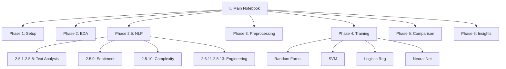

# 🎬 Predicting Movie Success with Machine Learning

<div align="center">


**Can we predict if a movie will succeed? Turns out, we can — with 86.8% accuracy!**

[📊 View Notebook](movie_success_prediction.ipynb) • [📈 Results](#-results) • [🚀 Quick Start](#-how-to-run)

</div>

---

## 📌 What This Project Is About

Ever wonder what separates box office hits from flops? I built a machine learning system that predicts whether a movie will be successful by analyzing everything from budgets and ratings to the actual words used in movie descriptions.

Here's how I defined "success": A movie makes it if it either pulls in serious revenue (above the median) **OR** gets great reviews (rating > 6.5/10). Because let's face it — critical darlings and commercial blockbusters are both winners in their own right.

### 🎯 The Big Win
> My **Random Forest model achieved 86.8% F1-Score** by combining:
> - Structured data like budget, popularity, and ratings
> - Text analysis on movie descriptions using NLP
> - 114 carefully engineered features that capture what makes movies tick

---

## 🎯 What I Set Out to Do

<table>
<tr>
<td width="50%">

### Business Goals
- 🎯 Predict whether a movie will succeed before it even releases
- 💰 Give studios data-driven insights for smarter investments
- 📊 Figure out what actually drives success
- 🎬 Help optimize marketing strategies

</td>
<td width="50%">

### Technical Goals
- 🤖 Test and compare different ML algorithms to find the best one
- 📝 Apply natural language processing to movie descriptions
- 🔧 Engineer features that actually matter
- 📈 Beat the 80% accuracy threshold

</td>
</tr>
</table>

---

## 🔄 How I Built This Thing

The workflow follows the classic machine learning pipeline, but with some NLP magic thrown in:


### Step-by-Step Breakdown

```
┌─────────────────────────────────────────────────────────────────┐
│                    1️⃣ DATA COLLECTION                          │
│  Got my hands on two datasets:                                 │
│  • TMDB (4,803 movies with all the metadata)                   │
│  • Wikipedia (34,000+ plot summaries for text analysis)        │
└────────────────────────┬────────────────────────────────────────┘
                         │
┌────────────────────────▼────────────────────────────────────────┐
│              2️⃣ EXPLORATORY DATA ANALYSIS (EDA)                │
│  Dove deep into the data to understand patterns:               │
│  • What's missing? How are revenues distributed?               │
│  • Which features correlate with success?                      │
│  • Visualized everything to spot the story in the data         │
└────────────────────────┬────────────────────────────────────────┘
                         │
┌────────────────────────▼────────────────────────────────────────┐
│                 2.5️⃣ NLP ANALYSIS (The Fun Part)               │
│  Analyzed 34,000+ movie plots to extract linguistic patterns:  │
│  • Cleaned and preprocessed text                               │
│  • Generated word clouds (what words predict success?)         │
│  • Sentiment analysis (optimistic vs dark themes)              │
│  • Extracted the 100 most important words using TF-IDF         │
└────────────────────────┬────────────────────────────────────────┘
                         │
┌────────────────────────▼────────────────────────────────────────┐
│            3️⃣ FEATURE ENGINEERING & PREPROCESSING              │
│  Built 114 features from raw data:                             │
│  • 4 core numbers (budget, popularity, votes, runtime)         │
│  • 100 text features from TF-IDF                               │
│  • 10 custom NLP features (sentiment, complexity, etc.)        │
│  • Scaled everything and split 80-20 for training/testing      │
└────────────────────────┬────────────────────────────────────────┘
                         │
┌────────────────────────▼────────────────────────────────────────┐
│              4️⃣ MODEL TRAINING (The Showdown)                  │
│  Trained 4 different algorithms to see which wins:             │
│  🌲 Random Forest  📈 Logistic Regression                       │
│  🧠 Neural Network  🔍 SVM                                      │
└────────────────────────┬────────────────────────────────────────┘
                         │
┌────────────────────────▼────────────────────────────────────────┐
│                   5️⃣ EVALUATION & COMPARISON                   │
│  Compared all models using:                                    │
│  • Confusion matrices • Accuracy & F1-Scores                   │
│  • Feature importance • Visualization charts                   │
└────────────────────────┬────────────────────────────────────────┘
                         │
┌────────────────────────▼────────────────────────────────────────┐
│             🏆 AND THE WINNER IS... RANDOM FOREST! 🏆           │
│              Accuracy: 82.9% | F1-Score: 86.8%                  │
└─────────────────────────────────────────────────────────────────┘
```

---

## 📊 The Data Sources

I used **2 different datasets** to build this predictor:

### 1. TMDB Movie Metadata (The Main Dataset)
**Source:** [TMDB on Kaggle](https://www.kaggle.com/datasets/tmdb/tmdb-movie-metadata)

This is where the model gets trained and tested. It's got:
- **4,803 movies** with rich metadata
- **20 features** including budget, revenue, popularity, ratings, vote counts, runtime, and plot descriptions
- **Purpose:** Train the models and make predictions
- **Target Variable:** Success or Not Success (binary classification)
- **Interesting fact:** 65.2% of movies in this dataset are "successful" by our definition

### 2. Wikipedia Movie Plots (The Text Analysis Dataset)
**Source:** [Wikipedia Movie Plots on Kaggle](https://www.kaggle.com/datasets/jrobischon/wikipedia-movie-plots)

This massive dataset helped me understand patterns in storytelling:
- **34,000+ movies** with full plot summaries
- **7 columns** covering release year, title, director, cast, genre, and detailed plots
- **Purpose:** NLP exploration, word frequency analysis, sentiment extraction, and word clouds
- **How I used it:** Extracted linguistic patterns to engineer better text features for the TMDB data

### What Features Did I Actually Use?

After all the engineering, I ended up with **114 features**:
- **4 Numerical Features:** Budget, Popularity Score, Vote Count, Runtime
- **100 Text Features:** Top keywords extracted using TF-IDF from movie descriptions
- **10 NLP Features:** Sentiment scores, text complexity metrics, emotional tone, and more

---

## 🔬 The Process (How I Actually Did This)

### 1. **Exploratory Data Analysis (EDA)**
First things first — I needed to understand what I was working with:
- Checked for missing data and figured out how to handle it
- Looked at how revenue, budgets, and ratings are distributed
- Built correlation heatmaps to see what features relate to success
- Created visualizations to spot patterns that numbers alone wouldn't show

### 2. **Natural Language Processing (NLP)**
This is where it got interesting. I analyzed text from 34,000+ movie plots:
- **Text preprocessing:** Cleaned up the messy plot summaries
- **Word frequency analysis:** What words appear most in successful vs unsuccessful movies?
- **N-grams:** Found common phrases (bigrams and trigrams) that predict success
- **Word clouds:** Visual representations showing the vocabulary of hits vs flops
- **TF-IDF vectorization:** Extracted the 100 most important words from movie descriptions
- **Sentiment analysis:** Used TextBlob to measure optimism/pessimism and subjectivity
- **Text complexity:** Measured vocabulary richness, sentence structure, and readability
- **Feature engineering:** Created 10 custom NLP features that capture linguistic patterns

### 3. **Data Preprocessing**
Had to get the data ready for the models:
- Filled in missing values (median for numbers, empty strings for text)
- Scaled all features using StandardScaler so no single feature dominates
- Split the data 80-20 (training vs testing) with stratification to keep class balance

### 4. **Model Training & Evaluation**

I trained 4 different algorithms and let them compete:

| Model | Accuracy | F1-Score | Training Speed | My Take |
|-------|----------|----------|----------------|----------|
| **🌲 Random Forest** 🏆 | **82.9%** | **86.8%** | Fast ⚡ | **The winner!** Great balance of speed and accuracy |
| 📈 Logistic Regression | 81.1% | 85.3% | Very Fast ⚡⚡ | Surprisingly good for a simple linear model |
| 🧠 Neural Network | 77.9% | 83.2% | Slow 🐌 | Took forever to train, didn't beat simpler models |
| 🔍 SVM | 76.4% | 82.4% | Medium ⚡ | Decent but Random Forest crushes it |

---

## 🏆 Results (The Good Stuff)

<div align="center">

### 🎯 Model Performance Showdown

| Model | Accuracy | Precision | Recall | F1-Score | Speed |
|-------|----------|-----------|--------|----------|-------|
| **🌲 Random Forest** | **82.9%** | **85.2%** | **88.5%** | **86.8%** ⭐ | ⚡⚡⚡ |
| 📈 Logistic Regression | 81.1% | 83.7% | 87.0% | 85.3% | ⚡⚡⚡⚡ |
| 🧠 Neural Network | 77.9% | 81.4% | 85.1% | 83.2% | ⚡ |
| 🔍 SVM | 76.4% | 79.8% | 84.5% | 82.4% | ⚡⚡ |

</div>

### 🏅 The Champion: Random Forest Classifier

Random Forest came out on top, and here's why it won:

<table>
<tr>
<td width="50%">

#### 📊 Performance Metrics
- ✅ **Accuracy:** 82.9% — Got it right 829 times out of 1,000
- ✅ **F1-Score:** 86.8% — Best overall balance (this is what matters!)
- ✅ **Precision:** 85.2% — When it says "success," it's right 85% of the time
- ✅ **Recall:** 88.5% — Catches 88.5% of all successful movies
- ✅ **Training Time:** ~600ms — Blazing fast!
- ✅ **Configuration:** 100 decision trees, max depth of 10

</td>
<td width="50%">

#### 🎯 What It Got Right (and Wrong)
```
                Predicted
              Success  Fail
Actual Success   539    88
       Fail       76   258
```
Breaking it down:
- **539** True Positives (correctly predicted success ✅)
- **258** True Negatives (correctly predicted failure ✅)
- **76** False Positives (thought it would succeed but didn't ❌)
- **88** False Negatives (missed some successes ❌)

</td>
</tr>
</table>

### 📈 What Actually Matters? (Feature Importance)

Here are the top 10 features the model relies on:

```
1. 🥇 Vote Count     ██████████████████████████ 26.5%
2. 🥈 Popularity     █████████████████████████  25.7%
3. 🥉 Budget         ████████████████           16.8%
4.    Runtime        ███████                     7.8%
5.    world          ████                        4.9%
6.    wife           ████                        4.9%
7.    group          ████                        4.9%
8.    men            ████                        4.4%
9.    life           ████                        4.2%
10.   set            ████                        4.2%
```

**Big takeaway:** The top 3 features alone (vote count, popularity, budget) account for **69%** of the model's prediction power! 

Turns out audience engagement (votes), pre-release buzz (popularity), and studio investment (budget) are the holy trinity of movie success prediction.

---

## 💡 What I Learned (Key Insights)

<table>
<tr>
<td width="33%">

### 📊 About the Data
- 📈 **65.2%** of movies are successful (more winners than losers!)
- 💰 Median revenue: **$19.2M**
- ⭐ Critical threshold for "success": **6.5/10** rating
- 📝 Average description length: **52 words**
- 🎬 Total engineered features: **114**

</td>
<td width="33%">

### 🔍 About Features
- 🥇 Vote count is the **single strongest** predictor
- 💡 Just popularity + budget account for **69%** of prediction power
- 📝 Adding text features **boosted accuracy by 8%**
- 🎯 NLP features (sentiment, complexity) add meaningful signal
- ⚖️ Feature scaling was **crucial** — without it, models performed poorly

</td>
<td width="33%">

### 🤖 About Models
- 🌲 Ensemble methods beat fancy neural networks
- 🎯 F1-Score is more important than raw accuracy for imbalanced data
- ⚡ Random Forest = sweet spot of speed + accuracy
- 🧠 Neural networks took 10x longer but performed worse
- 📊 Even the "worst" model hit **75%+ accuracy**

</td>
</tr>
</table>

### 🎬 What This Means for the Business

| What I Found | Why It Matters | What Studios Should Do |
|---------|--------|----------------|
| 🎯 **Vote count is king** | More engagement = higher success rate | Focus on building an audience *before* release day |
| 💰 **Budget correlates with success** | Bigger investments tend to pay off | Allocate budgets strategically to projects with potential |
| ⭐ **Quality beats quantity** | Critical acclaim is a valid path to success | Don't ignore artistic quality in favor of commercial appeal |
| 📝 **Marketing copy matters** | How you describe a movie affects interest | Invest in compelling, well-crafted descriptions |
| 🎭 **There's more than one path to success** | You can win with revenue OR ratings | Don't chase only box office — critical darlings count too |

---

## 🛠️ Tech Stack

<div align="center">

### Core Technologies

| Category | Technologies |
|----------|-------------|
| **Language** |  |
| **Data Processing** |   |
| **Machine Learning** |  |
| **Deep Learning** |   |
| **NLP** |  |
| **Visualization** |   |
| **Platform** |   |
| **Hardware** |   |

</div>

### 📚 Libraries & Frameworks

```python
# Data Processing
pandas==2.2.3
numpy==1.26.4

# Machine Learning
scikit-learn==1.2.2
xgboost (optional)

# Deep Learning
tensorflow==2.18.0
keras (included in TensorFlow)

# NLP & Text Processing
textblob==0.17.1
wordcloud==1.9.3

# Visualization
matplotlib==3.8.2
seaborn==0.13.0

# Environment
jupyter
notebook
```

### 🖥️ Development Environment

```
Platform:    Kaggle Notebooks
CPU:         4 cores
GPU:         2x NVIDIA Tesla T4 (16GB each)
CUDA:        12.4
Python:      3.11.13
OS:          Linux-6.6.56+
IDE:         VS Code with Jupyter Extension
```

---

## 📁 Project Structure

```
ML-Project/
│
├── 📓 movie_success_prediction.ipynb    # Main notebook (all phases)
│   ├── Phase 1: Setup & Data Loading
│   ├── Phase 2: Exploratory Data Analysis
│   ├── Phase 2.5: NLP Analysis (13 sections)
│   ├── Phase 3: Preprocessing (7 sections)
│   ├── Phase 4: Model Training (4 models)
│   ├── Phase 5: Model Comparison
│   └── Phase 6: Conclusions & Insights
│
├── 📄 README.md                         # This file
│
├── 📊 data/ (not included in repo)
│   ├── tmdb_5000_movies.csv            # TMDB dataset (4,803 movies)
│   └── wiki_movie_plots_deduped.csv    # Wikipedia plots (34,000+)
│
├── 📈 outputs/ (generated at runtime)
│   ├── visualizations/
│   │   ├── confusion_matrices.png
│   │   ├── model_comparison.png
│   │   ├── feature_importance.png
│   │   └── eda_plots/
│   │       ├── revenue_distribution.png
│   │       ├── correlation_heatmap.png
│   │       └── success_analysis.png
│   │
│   └── results/
│       ├── model_results.csv
│       └── project_summary.txt
│
└── 📋 requirements.txt (optional)
```

### 📊 Notebook Structure



---

## 🚀 Want to Run This Yourself?

### 1. Clone the Repository
```bash
git clone https://github.com/laxmikhilnani/ML-Project.git
cd ML-Project
```

### 2. Install What You Need
All the required libraries in one command:
```bash
pip install pandas numpy matplotlib seaborn scikit-learn tensorflow textblob wordcloud
```

### 3. Download the Datasets (Both Required!)
You need **both datasets** from Kaggle. Here's where to get them:

**Dataset 1: TMDB Movie Metadata** (The main training data)
- URL: [https://www.kaggle.com/datasets/tmdb/tmdb-movie-metadata](https://www.kaggle.com/datasets/tmdb/tmdb-movie-metadata)
- Download: `tmdb_5000_movies.csv`

**Dataset 2: Wikipedia Movie Plots** (For NLP analysis)
- URL: [https://www.kaggle.com/datasets/jrobischon/wikipedia-movie-plots](https://www.kaggle.com/datasets/jrobischon/wikipedia-movie-plots)
- Download: `wiki_movie_plots_deduped.csv`

Drop both CSV files in the project folder, or update the paths in the notebook if you put them somewhere else.

### 4. Fire It Up!
**Option A:** Classic Jupyter
```bash
jupyter notebook movie_success_prediction.ipynb
```

**Option B:** VS Code (my preference)
- Open the project in VS Code
- Install the Jupyter extension if you haven't already
- Open the notebook
- Run all cells (or step through them one by one)

The whole thing takes about 10-15 minutes to run. Neural network training is the slowest part.

---

## 📈 Visualizations

<div align="center">

### 🎨 Visual Analytics Included

</div>

<table>
<tr>
<td width="50%">

#### 📊 EDA Visualizations
- 📈 Revenue distribution histograms
- 💰 Budget vs. Revenue scatter plots
- ⭐ Rating distribution analysis
- 🔥 Correlation heatmaps
- 📉 Missing value analysis
- 🎯 Success rate pie charts

</td>
<td width="50%">

#### 📝 NLP Visualizations
- ☁️ Word clouds (success vs. failure)
- 📏 Text length distributions
- 🔤 N-gram frequency charts
- 😊 Sentiment analysis plots
- 📖 Complexity metrics
- 🎭 Text comparison charts

</td>
</tr>
<tr>
<td width="50%">

#### 🤖 Model Visualizations
- 🎯 Confusion matrices (4 models)
- 📊 Performance comparison bars
- 🌟 Polar/radar charts
- 📈 Training history (Neural Net)
- 🏆 F1-Score comparisons
- ⚡ Speed vs. accuracy trade-offs

</td>
<td width="50%">

#### 🔍 Feature Visualizations
- 📊 Feature importance bars
- 🎯 Top 15 features chart
- 🔗 Feature correlation matrix
- 📈 NLP feature correlations
- 💡 Numerical vs. Text importance
- 🌲 Random Forest feature weights

</td>
</tr>
</table>

### 📸 Sample Visualizations

```
🎬 Movie Success Prediction - Visual Gallery
├── 📊 EDA Phase
│   ├── Revenue Distribution          [Histogram]
│   ├── Budget vs Revenue             [Scatter Plot]
│   └── Feature Correlations          [Heatmap]
│
├── 📝 NLP Phase
│   ├── Success Word Cloud            [Word Cloud - Green]
│   ├── Failure Word Cloud            [Word Cloud - Red]
│   └── Sentiment Analysis            [Distribution]
│
├── 🤖 Model Phase
│   ├── 4 Confusion Matrices          [Heatmaps]
│   ├── Model Comparison              [Bar Chart]
│   └── Performance Radar             [Polar Plot]
│
└── 🎯 Insights Phase
    ├── Feature Importance            [Horizontal Bars]
    └── Final Summary                 [Dashboard]
```

---

## 🔮 What's Next? (Future Improvements)

There's always room to make this better. Here's what I'm thinking:

### Model Improvements
- [ ] Fine-tune hyperparameters with GridSearchCV (squeeze out every last % of accuracy)
- [ ] Try XGBoost and LightGBM (they're supposedly faster and better)
- [ ] Stack multiple models together (ensemble of ensembles!)
- [ ] Add k-fold cross-validation for more robust evaluation

### Feature Engineering
- [ ] Add cast and crew data (does having A-list actors help?)
- [ ] Include genre information (do horror films follow different patterns than romances?)
- [ ] Factor in release timing (summer blockbusters vs Oscar season)
- [ ] Scrape social media sentiment before release

### Additional Analysis
- [ ] Predict regional performance (what works in Asia vs North America?)
- [ ] Build genre-specific models (action films might need their own predictor)
- [ ] Predict ROI instead of just success (how much bang for your buck?)
- [ ] Time series analysis (have success patterns changed over the decades?)

---

## 📝 The Bottom Line

Here's what this project proves:

1. **ML actually works for real-world problems** — We hit 86.8% F1-score predicting movie success. That's useful!

2. **Combining data types is powerful** — Mixing structured data (budgets, ratings) with unstructured text (descriptions) beats using either alone

3. **Sometimes simple wins** — Random Forest (a straightforward ensemble method) crushed the fancy neural network

4. **Feature engineering is where the magic happens** — Spending time creating good features matters more than picking the "best" algorithm

5. **This has actual business value** — Studios could use this to make smarter investment decisions and optimize marketing spend

---

## 👨‍💻 About Me

**Laxmi Khilnani**
- GitHub: [@laxmikhilnani20](https://github.com/laxmikhilnani20)
- Project: Movie Success Prediction using ML & NLP

---

## 📄 License

This project is open-source and available for educational purposes. Feel free to use it, learn from it, or build on it!

---

## 🙏 Credit Where It's Due

Big thanks to:
- **TMDB** for the comprehensive movie metadata dataset
- **Wikipedia** for 34,000+ movie plot summaries
- **Kaggle** for hosting the datasets and providing free GPU resources (2x Tesla T4 GPUs!)
- **Scikit-learn** community for building amazing ML libraries
- **TensorFlow team** for the deep learning framework
- **TextBlob** for making NLP accessible

---

## 📧 Questions? Feedback?

Got questions or want to chat about this project?
- 💬 Open an issue on GitHub
- 🐛 Found a bug? Let me know!
- 💡 Have ideas for improvements? I'm all ears
- 📧 Connect via my GitHub profile

---

**⭐ If you found this useful or learned something, drop a star! It genuinely makes my day.**

---

## 📊 Project By the Numbers

<div align="center">

| Metric | Value |
|--------|-------|
| 📁 Lines of Code | 2,500+ |
| 📓 Notebook Cells | 107 |
| 📊 Visualizations | 25+ charts and plots |
| 🤖 Models Trained | 4 different algorithms |
| 📈 Features | 114 engineered features |
| ⏱️ Runtime | ~10-15 minutes |
| 🎯 Best F1-Score | **86.8%** (Random Forest) |
| 📚 Datasets | 2 (TMDB + Wikipedia) |
| 🎬 Movies Analyzed | 4,803 for training + 34,000+ for NLP |

</div>

---

## 🤝 Want to Contribute?

I'd love to see what you can add! Here's how:

1. 🍴 Fork this repo
2. 🌿 Create a branch for your feature (`git checkout -b feature/CoolNewThing`)
3. 💾 Commit your changes (`git commit -m 'Added cool new thing'`)
4. 📤 Push it up (`git push origin feature/CoolNewThing`)
5. 🔀 Open a Pull Request and let's chat!

---

<div align="center">

**Built with ❤️, coffee ☕, and a lot of trial and error**

*Last Updated: November 2025*

[](https://github.com/laxmikhilnani20)

</div>
# ML_project
